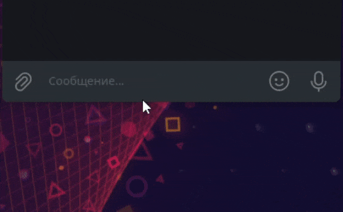
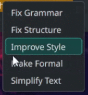
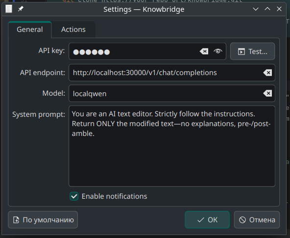
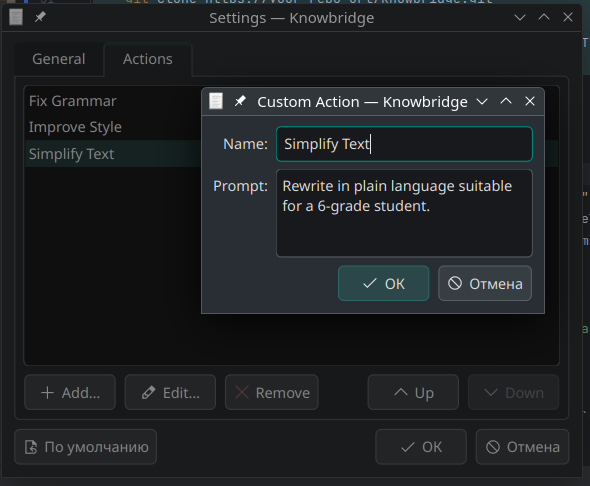

# Knowbridge ✨

**Edit text anywhere with AI!**

[](https://www.gnu.org/licenses/gpl-3.0)
[](https://github.com/OPHoperHPO/knowbridge/actions/workflows/build-in-docker.yml)

Knowbridge is a **KDE Plasma 6** tool that lets you leverage Large Language Models (LLMs) to edit text directly within **any application**. Simply select text, press a global keyboard shortcut, choose an action (like "Fix Grammar" or your own custom prompts) from a pop-up menu, and Knowbridge modifies the text in-place or copies the result to your clipboard.

[](docs/demo.gif)

---

## 🌟 Key Features

*   **🌐 Global Shortcut:** Trigger Knowbridge from any application using a configurable key combination.
*   **✍️ In-Place Editing:** Uses Accessibility Technology (AT-SPI) to retrieve selected text and replace it directly in most compatible applications.
*   **🖱️ Action Menu:** A convenient pop-up menu appears near your cursor, listing predefined and **customizable actions (prompts)**.
*   **⚙️ GUI Configuration:** Easily configure API endpoint, model name, API key, system prompt, and manage custom actions through a user-friendly settings dialog.
*   **🔌 Flexible AI Backend:** Designed to work with any OpenAI-compatible API. Use commercial services or local LLMs via tools like Ollama, llama.cpp, Jan, LM Studio, etc.
*   **📋 Clipboard Fallback:** Automatically copies the AI-generated result to your clipboard if in-place editing fails or isn't supported by the current application.
*   **💙 KDE Plasma Integration:** Built natively with Qt 6 and KDE Frameworks 6. Includes a system tray icon and allows shortcut configuration via KDE System Settings.
*   **🔔 Notifications:** Provides feedback on processing status (running, success, copied, error).

---

## 🚀 Installation

### Prerequisites

*   **Operating System:** Linux distribution running KDE Plasma 6.
*   **Accessibility:** A running AT-SPI D-Bus service (`at-spi2-core`). This is usually enabled by default on modern Linux desktops.
*   **API Access:** An accessible OpenAI-compatible API endpoint URL (e.g., `http://localhost:11434/v1` for Ollama) and, if required by the endpoint, an API key.

---

### Method 1: Build using Docker (Recommended for Testing/Isolation)

1.  Ensure you have `docker` and `docker-compose` installed.
2.  Clone the repository:
    ```bash
    git clone https://your-repo-url/knowbridge.git # Replace with your actual repo URL
    cd knowbridge
    ```
3.  Build and run the container detached:
    ```bash
    docker compose up -d --build
    ```
4.  The compiled application and necessary files will be available inside the container. To get a installable package or binary, you might need to adjust the `Dockerfile` or copy artifacts out. (***Note:*** *The original instructions mention installing from `./dist` after build - clarify how the user gets the installable artifact from the container or adjust the `Dockerfile` to output it.*)

---

### Method 2: Build from Source

1.  **Install Build Dependencies:**
    *   **Core Build Tools:** `cmake` (>= 3.16), C++17 compliant compiler (like `gcc` or `clang`), `pkg-config`, `git`
    *   **Qt 6:** `qt6-base`, `qt6-tools` (Development packages, version >= 6.6)
    *   **KDE Frameworks 6:** `extra-cmake-modules`, `kcoreaddons`, `kglobalaccel`, `ki18n`, `kxmlgui`, `knotifications`, `kconfig`, `kconfigwidgets`, `kwidgetsaddons` (Development packages, version >= 6.0)
    *   **Accessibility:** `at-spi2-core`, `atk`, `glib2` (Development packages)

    *Package names vary by distribution. You typically need the `-devel` (Fedora/openSUSE) or `-dev` (Debian/Ubuntu) versions.*

    **Example (Arch Linux):**
    ```bash
    sudo pacman -S --needed base-devel cmake extra-cmake-modules qt6-base qt6-tools kcoreaddons kglobalaccel ki18n kxmlgui knotifications kconfig kconfigwidgets kwidgetsaddons at-spi2-core atk glib2 git
    ```
    **Example (Debian/Ubuntu - *Package names might need adjustment*):**
    ```bash
    sudo apt update
    sudo apt install build-essential cmake extra-cmake-modules pkg-config git \
         qt6-base-dev qt6-tools-dev \
         libkf6coreaddons-dev libkf6globalaccel-dev libkf6i18n-dev libkf6xmlgui-dev \
         libkf6notifications-dev libkf6config-dev libkf6configwidgets-dev libkf6widgetsaddons-dev \
         libatk-bridge2.0-dev libatspi2.0-dev libglib2.0-dev
    ```

2.  **Clone the Repository:**
    ```bash
    git clone https://your-repo-url/knowbridge.git # Replace with your actual repo URL
    cd knowbridge
    ```

3.  **Configure and Build:**
    ```bash
    cmake -B build -DCMAKE_INSTALL_PREFIX=/usr -DCMAKE_BUILD_TYPE=Release
    cmake --build build
    ```

4.  **Install:**
    ```bash
    sudo cmake --install build
    ```

5.  **(Optional) Update System Databases:** After installation, sometimes required for icons, shortcuts, etc., to appear immediately.
    ```bash
    kbuildsycoca6 --noincremental
    update-mime-database /usr/share/mime
    ```

---

## ⚙️ Configuration

Knowbridge needs to know how to connect to your LLM API endpoint.

1.  **Start Knowbridge:** Launch it from your application menu or run `knowbridge` in the terminal. A tray icon should appear.
2.  **Open Settings:** Right-click the **System Tray Icon** and select "Settings…".
    *   **General Tab:**
        *   **API Endpoint URL:** The full URL to your OpenAI-compatible API (e.g., `https://api.openai.com/v1` or `http://localhost:11434/v1`).
        *   **API Key:** Your API key (if required by the endpoint). Leave blank if not needed.
        *   **Model:** The name of the model to use (e.g., `gpt-4o`, `llama3`).
        *   **System Prompt:** (Optional) A default instruction given to the AI for context.
        *   **Notifications:**  Configure if you don't want to see notifications.
    *   **Actions Tab:**
        *   Add, edit, remove, and reorder the custom actions/prompts that appear in the pop-up menu. Each action needs a Name (shown in menu) and a Prompt.
3.  **Set Global Shortcut:**
    *   Go to KDE **System Settings** -> **Keyboard** -> **Shortcuts** -> **Knowbridge**.
    *   Find the **Knowbridge** entry.
    *   Select the "Modify Text (AI)" action.
    *   Click the button to assign your preferred shortcut (Default suggested: `Meta+Ctrl+Space` or `Ctrl+Alt+Space`).

---

## ▶️ How to Use

1.  **Run Knowbridge:** Make sure Knowbridge is running (check for the system tray icon).
2.  **Select Text:** Highlight the text you want to modify in *any* application.
3.  **Press Shortcut:** Trigger the global shortcut you configured.
4.  **Choose Action:** The Knowbridge Action Menu will pop up near your cursor. Click the desired action (e.g., "Fix Grammar", "Summarize", "Translate to French").
5.  **Wait for Result:** You'll see a notification indicating progress.
    *   ✅ **Success:** The selected text is automatically replaced with the AI's response.
    *   📋 **Result Copied:** In-place editing failed (e.g., unsupported application). The AI's response has been copied to your clipboard. Paste it manually (`Ctrl+V`).
    *   ❌ **Error:** An error occurred (e.g., API connection issue, invalid key). Check the notification details and your settings.

---

## 📸 Screenshots

**Action Menu Popup:**


**Settings - General Tab:**


**Settings - Actions Tab:**


---

## 🚧 Roadmap / TODO

*   [ ] Improve AT-SPI compatibility, especially under Wayland and with GTK applications.
*   [ ] Enhance User Experience (e.g., clearer progress indication during API calls, more informative error messages).
*   [ ] Add advanced features to custom actions (e.g., placeholders beyond `{selected_text}`, import/export actions).
*   [ ] Investigate potential sandboxing/security implications (e.g., Flatpak).
*   [ ] Improve code quality, add unit/integration tests.
*   [ ] Explore packaging options (AUR, Flathub, distribution repositories).
*   [ ] Add option for streaming responses.

---

## 🤝 Contributing

Contributions are welcome! Please feel free to submit Issues and Pull Requests. If you plan to add a major feature, please open an issue first to discuss the approach.

<!-- Optional: Add a link to a CONTRIBUTING.md file if you have one -->
<!-- See [CONTRIBUTING.md](CONTRIBUTING.md) for more details. -->

---

## 📜 License

This project is licensed under the **GPLv3.0**. See the [LICENSE](LICENSE) file for details.